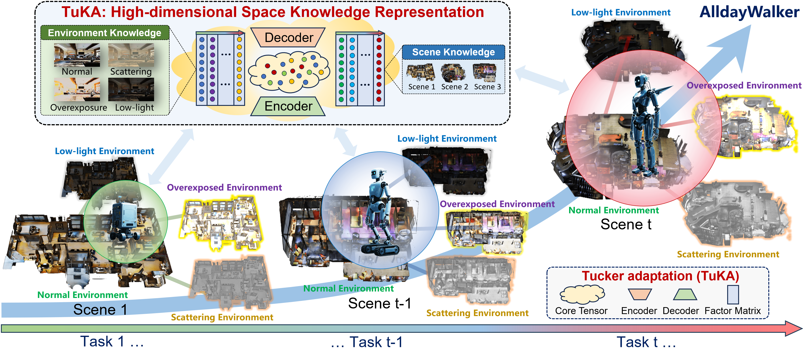

<br>
<p align="center">
  <h1 align="center"><strong>AlldayWalker: All-Day Multi-Scenes Lifelong Vision-And-Language Navigation With Tucker-Adaption</strong></h1>
</p>



## Overview

This project implements a continual learning approach for Vision and Language Navigation (VLN) tasks using StreamVLN as the base architecture, enhanced with 4D Tucker-LoRA for efficient parameter sharing across multiple scenes and environments.

### Key Features

- **4D Tucker-LoRA**: Parameter-efficient fine-tuning using 4D Tucker decomposition
- **Hard Routing**: Intelligent scene and environment selection
- **Continual Learning**: EWC (Elastic Weight Consolidation) for catastrophic forgetting prevention
- **Multi-Scene Support**: Training across multiple environments with shared knowledge
- **StreamVLN Integration**: Built on top of StreamVLN with Qwen-1.5 language model

## Architecture

### 4D Tucker Decomposition
The core innovation uses 4D Tucker decomposition to factorize LoRA parameters:
- **G**: Core tensor (r1, r2, r3, r4)
- **U1**: Output projection matrix (out_features, r1)
- **U2**: Input projection matrix (in_features, r2)  
- **U3**: Scene matrix (scene_num, r3)
- **U4**: Environment matrix (env_num, r4)

### Hard Routing System
- Scene-based routing
- Environment-based routing
- Dynamic route selection during inference
- Task-specific parameter activation

## Installation

### Project Setup
```bash
git clone https://github.com/AlldayWalker/AlldayWalker.git
cd alldaywalker
```

### Prerequisites
```bash
# Create conda environment
conda create -n alldaywalker python=3.9
conda activate alldaywalker

# Install PyTorch (adjust CUDA version as needed)
pip install torch torchvision torchaudio --index-url https://download.pytorch.org/whl/cu118

# Install other dependencies
pip install transformers accelerate deepspeed wandb
pip install opencv-python pillow numpy pandas
pip install -r requirements.txt
```

### Habitat-Sim Setup
```bash
# Install Habitat-Sim for AlldayWalker VLN environments
conda install habitat-sim==0.2.4 withbullet headless -c conda-forge -c aihabitat
git clone --branch v0.2.4 https://github.com/facebookresearch/habitat-lab.git
cd habitat-lab
pip install -e habitat-lab  # install habitat_lab
pip install -e habitat-baselines # install habitat_baselines
```

## Usage

### Training

#### Continual Learning Training
```bash
bash scripts/alldaywalker_train.sh
```

Key training parameters:
- `NUM_TASKS=20`: Number of continual learning tasks
- `TUCKER_RANKS_4D="16,16,32,32"`: Tucker decomposition ranks
- `EWC_LAMBDA=5000`: EWC regularization strength
- `USE_ORTHOGONAL_REG=true`: Enable orthogonal constraints

#### Single Task Training
```bash
torchrun --nproc_per_node=4 streamvln/alldaywalker_train.py \
  --model_name_or_path model_zoo/StreamVLN_Video_qwen_1_5_r2r_rxr_envdrop_scalevln \
  --use_tucker_4d true \
  --tucker_scene_num 5 \
  --tucker_env_num 4 \
  --tucker_ranks_4d "16,16,32,32" \
  --continual_learning true \
  --current_task_id 0
```

### Evaluation

#### Multi-Scene Evaluation
```bash
bash scripts/alldaywalker_eval.sh
```

#### Single Scene Evaluation
```bash
torchrun --nproc_per_node=2 streamvln/streamvln_eval.py \
  --model_path checkpoints/tucker_4d/task_19 \
  --base_model_path model_zoo/StreamVLN_Video_qwen_1_5_r2r_rxr_envdrop_scalevln \
  --eval_split 'val_seen_5LpN3gDmAk7' \
  --use_hard_routing \
  --scene_idx 0 \
  --env_idx 1
```

## Configuration

### Model Configuration
```python
# 4D Tucker-LoRA Parameters
TUCKER_SCENE_NUM = 5        # Number of scenes
TUCKER_ENV_NUM = 4          # Number of environments
TUCKER_RANKS_4D = (16, 16, 32, 32)  # Tucker ranks (r1, r2, r3, r4)
TUCKER_INIT_SCALE = 0.02    # Initialization scale
LORA_ALPHA = 32             # LoRA scaling factor

# Continual Learning Parameters
EWC_LAMBDA = 5000           # EWC regularization weight
EWC_MODE = "online"         # EWC mode: "online" or "offline"
USE_ORTHOGONAL_REG = True   # Orthogonal constraint for U3, U4
ORTHO_REG_WEIGHT = 0.01     # Orthogonal regularization weight
```

### Hard Routing Configuration
Routes are defined in `route_config.json`:
```json
{
  "0": {"scene_idx": 0, "env_idx": 0, "task_name": "task_0"},
  "1": {"scene_idx": 0, "env_idx": 1, "task_name": "task_1"},
  ...
}
```

## File Structure

```
alldaywalker/
├── alldaywalker/
│   ├── model/
│   │   ├── tucker_lora_layers.py
│   │   ├── continual_learning.py
│   │   └── tucker_lora_layers.py
│   ├── alldaywalker_train.py
│   ├── alldaywalker_eval.py
│   └── args.py.py
├── asset/
│   └── F1.png
├── scripts/
│   ├── alldaywalker_eval.sh
│   ├── alldaywalker_train.sh
│   ├── zero2.json
│   └── zero3.json
├── config/
│   ├── vln_r2r_moderate_overexposure.yaml
│   ├── vln_r2r_night_scene.yaml
│   ├── vln_r2r_urban_smog.yaml
│   └── vln_r2r.yaml
├── .gitignore
├── LICENSE
├── README.md
└── requirements.txt
```